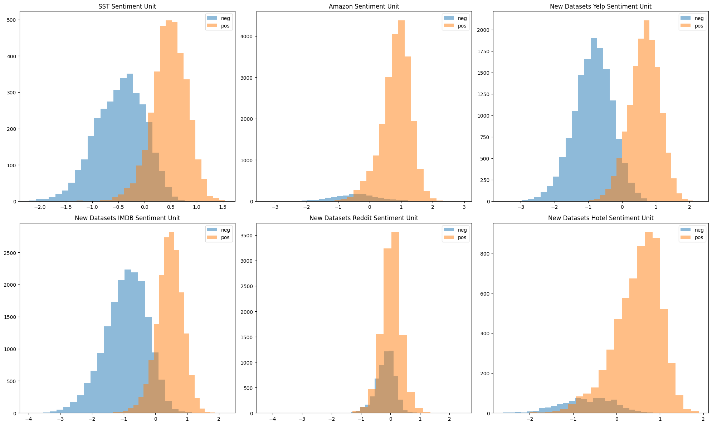
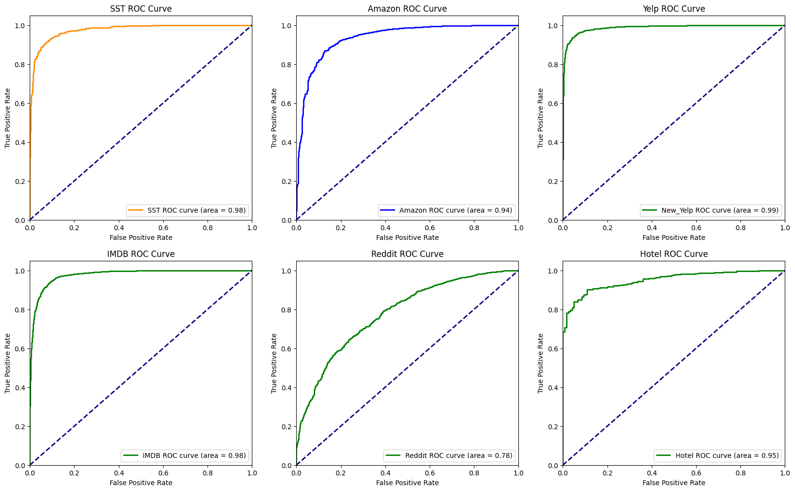

# Replication of Learning to Generate Reviews and Discovering Sentiment question: 👨‍💻 🛰️

In today's world of abundant research papers, reproducing and confirming the findings in these papers is getting harder. This repository is aimed to reproduce the results of the paper titled ”Learning to Generate Reviews and Discovering Sentiment”.  Our main goal is to show the initial claim of paper holds and we further replicate the findings on unseen data sets to show that the results are consistent.

## Original Paper

* "Learning to Generate Reviews and Discovering Sentiment"(2017) is a research paper authored by Alec Radford, Rafal Jozefowicz, and Ilya Sutskever.

* The paper presents a novel approach to generating text reviews and discovering sentiment in an unsupervised manner.

* Unlike traditional sentiment analysis, which relies on labeled data, this work leverages a large dataset to train a character-level recurrent neural network (char-RNN) model.

* [Link to the paper](https://arxiv.org/abs/1704.01444)

* [Link to the original github repository](https://github.com/openai/generating-reviews-discoering-sentiment)

## Replication of Original Work
To successfully replicate the source work

* **Data Collection** : Original work was built using Amazon Product Reviews (82 million reviews) from May 1996 to July 2014. We test the model on new datasets : Yelp, IMDB, SST, Hotel, Reddit.

* **Methodology** :
  * Researchers will replicate the model training and sentiment analysis process described in the paper. 
  * Ensure that the code is in the same state as when the experiments were conducted.
  * Ensure that the model architecture, hyperparameters, and training procedures are faithfully reproduced.
  * Implement the same performance evaluation metrics as used in the paper: Test Accuracy, Precision, AUC-ROC curves.

## Result

**Distribution of Sentiment**

Note that Amazon, Reddit, and Hotel datasets have a higher number of positive reviews compared to negative ones, indicating a class imbalance in those datasets. On the other hand, the remaining datasets appear to have a more balanced distribution of positive and negative reviews.

**Accuracy and F1 Score**
| Dataset      | Accuracy (%) | F1 Score (%) |
|--------------|--------------|-------------|
|  Amazon   |    95.24     |    97.48     |
| SST   |     91.76    |   91.87    |
| Yelp     | 94.4         | 94.37       |
| IMDB    | 92.32        | 92.42       |
| Reddit   | 73.66        | 81.41       |
| Hotel   | 92.1         | 95.62       |

These results collectively show that the model's performance replicates well across multiple datasets, with some variations in more challenging domains like Reddit.

**Classification Report**
| Dataset      | Precision (Class 0) | Precision (Class 1) | Recall (Class 0) | Recall (Class 1) | F1-Score (Class 0) | F1-Score (Class 1) | Accuracy | Support |
|--------------|----------------------|----------------------|------------------|------------------|--------------------|--------------------|----------|---------|
| Amazon data  | 0.75                 | 0.96                 | 0.47             | 0.99             | 0.58               | 0.97               | 0.95     | 6926    |
| SST data     | 0.93                 | 0.91                 | 0.90             | 0.93             | 0.92               | 0.92               | 0.92     | 1821    |
| Yelp data    | 0.94                 | 0.94                 | 0.94             | 0.94             | 0.94               | 0.94               | 0.94     | 4000    |
| IMDB data    | 0.93                 | 0.92                 | 0.92             | 0.93             | 0.92               | 0.92               | 0.92     | 5000    |
| Reddit data  | 0.67                 | 0.76                 | 0.46             | 0.88             | 0.55               | 0.81               | 0.74     | 2411    |
| Hotel data   | 0.76                 | 0.93                 | 0.50             | 0.98             | 0.60               | 0.96               | 0.92     | 1000    |

**ROC Curve**
ROC (Receiver Operating Characteristic) curves are a valuable tool for assessing the performance of binary classification models, particularly in scenarios where class imbalance is present. The ROC curve visually represents the trade-off between the true positive rate (sensitivity) and the false positive rate (1-specificity) at different classification thresholds. 

The ROC curves for the six datasets suggest varying degrees of model performance. While datasets like Amazon and Hotel show strong discrimination between classes, others, such as Reddit, exhibit a trade-off between precision and recall due to class imbalances.

**Reflection**

The overall replication of the paper can be considered a success. When testing the results with our new data set, the model was largely able to perform as well as it claimed in the paper. However, we did
encounter certain problems while replicating the original work. An example of the problems we faced included not being able to run the code originally provided by the paper. As such, we had to use the PyTorch version and build the classifier from scratch. We eventually succeeded in reproducing the original code and pertaining the model with new data.
